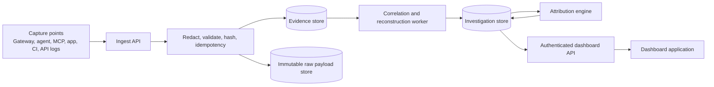

# From Demo Dashboard to Live Forensics Workbench

## Purpose

The current dashboard presents the intended AI Forensics and Attribution workflow, but its investigations, metrics, evidence, timelines, AI systems, and findings are static demo data in `index.html`.

This plan defines the technical work required to make every dashboard view read real forensic data without weakening the evidence-first model:

1. Capture real AI and surrounding-system events.
2. Preserve, redact, and verify the source evidence.
3. Reconstruct an investigation from that evidence.
4. Derive explicit root-cause and AI-attribution conclusions.
5. Serve authenticated, traceable data to the dashboard.

## Forensic Scope

The engine is a black box retained before an incident, then opened when an AI-related failure is suspected. Its job is to reconstruct the sequence of events and determine the root cause and the role AI actually played: `AI_CAUSED`, `AI_CONTRIBUTED`, `AI_INVOLVED_NOT_CAUSAL`, `NON_AI_ROOT_CAUSE`, or `INSUFFICIENT_EVIDENCE`.

It does **not** calculate financial loss, estimate business damage, or make a liability determination. An outside incident-management or business-impact process may use the forensic record, but those conclusions are not generated by this engine and must not appear as attribution evidence.

The timeline is a retained forensic artifact, not an incident-only visual. Authorized investigators must be able to reopen an investigation later, navigate from every timeline event to the source evidence, and see explicit gaps where capture coverage was unavailable.

This public repository is dashboard-only. It contains no private engine source code, credentials, evidence, or live case data. The private implementation repository is the source of truth for production work.

## Current State

Already implemented in the private engine:

- Local FlightRecord ingestion, query, and deterministic evidence-first attribution.
- Local JSONL evidence storage, redaction, bounded storage, and hash chaining.
- Gateway capture for supported model-provider traffic and a local CLI reader.

Not yet implemented:

- Persistent investigations/cases.
- Durable structured evidence, timeline, finding, or contributing-factor records.
- Correlation between AI events, tool/API calls, application events, and a detected failure.
- AI-system inventory derived from observed evidence.
- Dashboard data API, dashboard authentication, or a production deployment.
- A live dashboard client; the current file embeds `const DATA = ...` demo records.

## Product Rules That the Live System Must Preserve

- Evidence first. Derived conclusions must always link to immutable evidence IDs.
- **Evidence** is an immutable captured source record: the event, source, timestamps, redaction state, hashes, chain state, and retained payload reference. It is never rewritten to fit a narrative.
- **Forensic Notes** are optional, reviewable navigation aids that describe what the evidence set shows and link to exact evidence IDs. They do not alter evidence, label behavior as right or wrong, or establish impact, liability, or truth beyond the captured record.
- Root Cause and AI Attribution are independent fields. Do not infer one from the other.
- Business impact and financial loss are outside the attribution model and must not affect its verdict.
- Unknown remains Unknown. The API must return missing evidence and capture gaps rather than manufacture a conclusion.
- Evidence strength is qualitative: `Strong`, `Moderate`, or `Limited`. Do not display invented percentages.
- Every conclusion records the evidence set, policy/rule version, actor, and time used to create it.
- A broken evidence chain, unavailable source, or incomplete causal window makes attribution provisional.

## Executed Action and Outcome Evidence

The engine must distinguish intent from effect. A model response or requested tool call shows what AI proposed; it does not by itself prove that a target system executed the action or that the action created the observed failure.

For each consequential action, retain the following separate records when available:

| Evidence layer | What it answers | Preferred representation |
| --- | --- | --- |
| AI request / tool intent | What did the model ask a tool to do? | Redacted structured request, tool arguments, target, hashes. |
| Observed execution | Did the tool or target system run it? | Target-system status, request/job/transaction ID, redacted result body, result hash. |
| Observed outcome | What did the target system return, change, or emit? | API receipt, audit-log event, database audit event, deployment record, runtime log, or repository diff. |
| Supporting visual state | What did a human-facing surface show at that time? | Hash-addressed screenshot/video reference with capture time, source, and retention reference. |

Structured text, receipts, audit events, and diffs are primary because they are searchable, timestamped, and can be correlated. Screenshots are supporting artifacts: use them when the visual state matters, but never substitute them for a target-system receipt or log. Store an artifact hash and immutable storage reference; the dashboard should render a preview only after authorization and preserve the original hash/reference in the case report.

### Attribution gate

`AI_CAUSED` requires all of the following inside the bounded causal window:

1. An AI-requested action maps to the exact failing surface.
2. A successful observed execution **or** authoritative target artifact confirms the action/outcome.
3. The chain and evidence manifest are intact enough to support the conclusion.

If the first condition exists but execution/outcome evidence is missing, the engine returns `AI_CONTRIBUTED` or `INSUFFICIENT_EVIDENCE` with an explicit coverage gap. It must not promote intent to a proven effect. The current `attributeIncident` implementation now applies this gate to its local FlightRecords.

## Target Architecture



### Runtime components

| Component | Responsibility | Initial implementation choice |
| --- | --- | --- |
| Capture points | Emit AI, tool, app, and failure-detection events with correlation IDs. | Extend the existing gateway and universal ingest contract; add SDK/agent/CI adapters. |
| Ingest API | Authenticate capture clients, validate schemas, redact secrets, hash payloads, deduplicate retries. | Node.js API service based on current route patterns. |
| Evidence store | Store normalized, queryable metadata and evidence relations. | PostgreSQL. |
| Raw evidence store | Retain encrypted redacted source payloads too large for PostgreSQL. | S3-compatible object storage with immutable object versioning. |
| Worker | Correlate records, build timelines, detect gaps, and update case summaries. | Queue-backed Node.js worker. |
| Attribution service | Run deterministic policy against a bounded investigation evidence set. | Version every run. |
| Dashboard API | Read-only, authenticated API tailored to the dashboard views. | `/api/v1/*` routes with RBAC and tenant scoping. |
| Dashboard | Replace embedded demo data with API requests, loading/empty/error states, and evidence navigation. | Build and deploy a protected production application. |

## Required Data Model

Use a relational database for the investigation graph. Raw content remains separately retained and is referenced by immutable hashes and storage keys.

| Entity | Required fields | Notes |
| --- | --- | --- |
| Workspace | `id`, `name`, `created_at` | Tenant boundary for every record. |
| AI System | `id`, `workspace_id`, `name`, `application`, `provider`, `model`, `first_seen_at`, `last_seen_at` | Build from observed evidence, not manual claims alone. |
| Investigation | `id`, `workspace_id`, `title`, `status`, `detected_at`, `last_known_good_at`, `failure_summary`, `root_cause`, `root_cause_status`, `evidence_strength`, `created_at`, `updated_at` | The primary dashboard row. Root cause may be `unknown` while investigating. |
| Evidence Item | `id`, `workspace_id`, `investigation_id`, `type`, `source`, `occurred_at`, `captured_at`, `payload_hash`, `chain_hash`, `raw_object_key`, `redaction_status`, `integrity_status` | E-IDs in the dashboard come from this entity. |
| Action Execution | `id`, `evidence_id`, `tool_name`, `target`, `status`, `result_hash`, `external_reference`, `occurred_at` | Separates requested tool intent from observed target execution. |
| Artifact Reference | `id`, `evidence_id`, `kind`, `content_hash`, `storage_reference`, `captured_at` | Hash-addressed receipt, audit log, diff, runtime log, or screenshot. |
| Timeline Event | `id`, `investigation_id`, `evidence_id`, `occurred_at`, `kind`, `summary`, `role` | Retained forensic timeline; `role` supports `observed`, `ai_influence`, `failure_origin`, or `gap`. |
| Evidence Relation | `from_evidence_id`, `to_evidence_id`, `relation_type`, `reason` | Connects causal sequence, shared correlation IDs, and supporting material. |
| Forensic Note | `id`, `investigation_id`, `ordinal`, `statement`, `status`, `created_at`, `created_by` | Reviewable neutral observation; must link to evidence and cannot mutate it. |
| Note Evidence | `note_id`, `evidence_id`, `reference_type` | Makes note-to-evidence navigation real. |
| Contributing Factor | `id`, `investigation_id`, `statement`, `status`, `evidence_basis` | Must never be merged into root cause. |
| Attribution Run | `id`, `investigation_id`, `verdict`, `headline`, `policy_version`, `chain_intact`, `created_at`, `created_by` | Store the actual analysis output, including gaps. |
| Attribution Evidence | `attribution_run_id`, `evidence_id`, `role`, `reason` | Records exactly why a verdict was returned. |
| Case Report | `id`, `investigation_id`, `format`, `evidence_manifest_hash`, `generated_at`, `generated_by`, `audit_event_id` | Immutable export manifest; generated from persisted case state. |
| Audit Event | `id`, `workspace_id`, `actor_id`, `action`, `entity_type`, `entity_id`, `at` | Covers reads of sensitive evidence and all conclusion edits. |

## Evidence and Correlation Contract

Every event sent to ingestion must have a stable envelope. Extend the existing FlightRecord input rather than replacing it abruptly.

```json
{
  "eventId": "uuid",
  "workspaceId": "uuid",
  "occurredAt": "2026-08-18T09:41:07.000Z",
  "capturePoint": "gateway|agent|mcp|application|tool|ci|detector",
  "eventType": "ai_response|tool_call|tool_result|application_event|api_call|failure_detected",
  "correlationId": "request-or-trace-id",
  "causationId": "parent-event-id-or-null",
  "aiSystem": { "name": "...", "provider": "...", "model": "..." },
  "target": { "kind": "file|table|endpoint|resource", "value": "..." },
  "actionExecution": { "status": "succeeded|failed|unknown", "externalReference": "request-or-job-id", "result": "redacted target response" },
  "artifacts": [{ "kind": "api_receipt|audit_log|diff|runtime_log|screenshot", "contentHash": "...", "storageReference": "..." }],
  "payload": { "redacted": true, "...": "schema-specific fields" }
}
```

Rules:

- The server stamps `capturedAt`, canonical payload hash, chain/hash metadata, and the authenticated workspace.
- `eventId` makes ingestion idempotent. Retried requests must return the original record, not create duplicates.
- Capture adapters must propagate W3C trace context or a product correlation ID through model calls, tools, application handlers, and failure detectors.
- Raw prompts/responses remain opt-in, encrypted, redacted, and access-controlled. Metadata and short excerpts are the default.
- Capture adapters must record the target-system result for consequential tools where that system exposes a receipt, job ID, audit event, diff, or response; otherwise they emit an explicit outcome-capture gap.
- A timeline event must link to at least one Evidence Item. A visual gap must exist where the system cannot bridge two events.

## Investigation Lifecycle

1. A failure detector, an operator, or an integration creates an Investigation with detection time and affected surface.
2. A worker scopes evidence by workspace, time window, correlation ID, branch/commit, target, and related system IDs.
3. The worker creates Timeline Events from source evidence and explicitly marks missing coverage.
4. An analyst may attach evidence, correct time boundaries, and record facts. These edits are audited.
5. The attribution service runs against the investigation's fixed evidence set and stores an Attribution Run.
6. Root cause, contributing factors, and forensic notes are recorded separately. Every note must contain direct evidence links.
7. The timeline and its source evidence remain queryable after closure, subject to retention and access policy.
8. The dashboard reads only persisted investigation projections; it must never recreate conclusions in the browser.

## Investigator-Led Search and Timeline Reconstruction

The primary workflow is not “learn a case from Forensic Notes.” A user must be able to search for a known or suspected incident and open the retained black box around that incident. Forensic Notes are optional evidence-linked navigation aids after the record is assembled; they never become an input that invents a timeline.

### Search workflow

1. An investigator searches by case ID, time range, affected system, AI system/model, tool/action, correlation ID, deployment/commit, source, target (file/table/endpoint), status, or evidence ID.
2. If the incident is not already a case, the investigator creates one with a required `detectedAt` value and optional last-known-good time, affected target, correlation ID, and failure symptom.
3. The server scopes the retained evidence to the workspace and selected bounds, verifies the chain, and builds a timeline ordered by occurrence time.
4. Every timeline row links to its immutable evidence item. Events with no evidence link are displayed only as explicit `gap` records, never inferred steps.
5. The investigator can narrow or expand the search bounds; every attribution run and report records the exact evidence manifest and query bounds used.

### Required production functions

| Function / endpoint | Responsibility |
| --- | --- |
| `searchInvestigations(filters)` / `GET /api/v1/investigations` | Search persisted cases by ID, text, status, system, time, and attribution state. |
| `searchEvidence(filters)` / `GET /api/v1/evidence` | Search raw evidence by time, correlation ID, provider/model, tool, target, source, hash, and capture status. |
| `createInvestigation(input)` / `POST /api/v1/investigations` | Create a case from the incident boundary; `detectedAt` is mandatory. |
| `buildTimeline(investigationId, bounds)` / `GET /api/v1/investigations/{id}/timeline` | Query scoped evidence, order it, join causal/correlation links, verify integrity, and emit only evidence-backed events plus explicit gaps. |
| `attributeInvestigation(investigationId, manifestId)` / `POST /api/v1/investigations/{id}/attribution-runs` | Call the deterministic attribution engine using the frozen evidence manifest. |
| `generateCaseReport(investigationId, manifestId)` / `POST /api/v1/investigations/{id}/reports` | Generate the auditable case record from the same frozen evidence manifest. |

The current local primitives are useful building blocks: `readFlightRecords` filters by time, branch, and file; `verifyChain` validates record integrity; and `attributeIncident` evaluates a bounded incident descriptor. The production functions above add persistence, authorization, richer search indexes, correlation, and immutable query manifests.

## Use-Case Catalogue: What Learns and What Does Not

Forensic Notes do not teach the engine automatically. Allowing text notes to rewrite detection logic would create untraceable, unstable behavior. The system instead learns coverage in a controlled way through versioned deterministic rule packs.

- `ingestUseCaseCandidate(source)` records a candidate from an approved public source with its provenance, date, and category.
- `normalizeUseCaseCandidate(candidate)` maps it to the event signals, required evidence, expected gaps, and a regression fixture.
- `reviewUseCaseCandidate(candidate, reviewer)` requires a human acceptance/rejection decision.
- `publishRulePack(version)` activates only reviewed rules after fixture and false-positive tests pass in CI.
- `evaluateRulePack(manifest, version)` may add evidence-linked reference markers to an investigation, but it cannot replace the captured timeline or issue a causal verdict without `attributeIncident`-style evidence rules.

Use free, cached RSS/Atom feeds and GitHub advisory APIs from named sources such as OWASP GenAI, MITRE ATLAS, NIST, vendor postmortems, and security advisories. Use ETags, daily/weekly schedules, and a human review queue. No paid LLM, autonomous web crawler, or automatic rule activation is required.

## Connecting One Authorized Workstation and Cloud Environment

Monitoring must be explicit, authorized, and scoped. The product should never attempt to inspect an entire workstation or cloud tenant through broad credentials. Begin with one named workstation, one named cloud workspace/account, one AI workflow, and a written capture scope.

### Information and access needed before connection

| Area | Required input or permission | Minimum safe scope |
| --- | --- | --- |
| Workstation | Operating system, enrolled user, project directory, approved agent/IDE/CLI tools, local proxy permission, local storage location, retention period. | User-level launch agent or wrapper for the named AI workflow only; no full-disk access. |
| AI providers | Provider names, approved API base URLs, model SDKs/clients, existing secret-management path, streaming requirement. | Redirect only the named client through the localhost gateway or add the SDK capture hook; never copy provider keys into the dashboard. |
| Agent and tool layer | Agent framework, MCP servers, tool schemas, allowed tools, action targets, correlation-header support. | Install a wrapper/hook only for the approved agent process and tools. |
| Application/failure source | Application service identity, failure signal or alert source, log/event access, deployment/commit source. | Read-only event subscription or a minimal webhook that emits a failure-detected event. |
| Cloud account | Cloud/provider, account/project/subscription ID, region, existing network path, storage/database choice, identity provider. | Dedicated project/resource group and least-privilege service identity; no owner/admin tenant role. |
| Identity and privacy | SSO/OIDC tenant, approved user groups, data classification, retention/deletion policy, legal/privacy approval. | Investigator/read-only/capture-service roles with workspace isolation. |

### Workstation capture deployment

1. Install the gateway as a user-scoped local service bound to `127.0.0.1`, or add the SDK/agent hook to the named workflow.
2. Configure the selected client to use the local gateway or hook; retain provider credentials only in the existing OS keychain, secret manager, or runtime environment.
3. Configure metadata/excerpt capture, redaction additions, disk cap, retention, and the approved provider allowlist in `.blackbox.json`.
4. Add a correlation ID at the workflow entry point and propagate it into model requests, MCP/tool calls, application requests, and failure events.
5. Send a harmless test request, verify the redacted FlightRecord, verify its hash chain, and confirm the customer workflow still works if capture is stopped.
6. For production, buffer a bounded local retry queue and emit a coverage-gap event when capture cannot be delivered; never block the underlying AI request.

### Cloud control-plane deployment

1. Deploy the private application/API, PostgreSQL, object storage, and secrets manager in a dedicated cloud project/resource group and one chosen region.
2. Create separate least-privilege identities for capture ingestion, correlation worker, dashboard users, and deployment automation.
3. Place ingestion behind TLS, authenticate capture clients with short-lived credentials or mTLS, enforce workspace ID from identity, and rate-limit requests.
4. Store queryable redacted metadata in PostgreSQL and encrypted retained payloads only when the capture-depth policy allows them; use object-versioning and lifecycle retention.
5. Run the timeline/correlation worker from an idempotent job table first. It receives captured events and failure-detected events, creates evidence-backed timelines, and emits explicit gaps.
6. Enable audit logging, daily chain verification, backup monitoring, alerting on capture gaps, and a tested restore path before real incident onboarding.

### First pilot acceptance test

Use a non-destructive, pre-agreed test workflow on the named workstation: one AI request, one tool or application action, and one synthetic failure-detected event all sharing a correlation ID. The pilot is accepted only when an investigator can search the event, open the timeline, navigate every displayed event to evidence, see chain status and any gaps, run the bounded attribution, and export the same evidence manifest. No conclusion about business impact is generated.

## API Required by the Dashboard

All routes are workspace-scoped, authenticated, authorization-checked, paginated, and return only redacted content appropriate for the caller's role.

| Route | Purpose | Dashboard consumer |
| --- | --- | --- |
| `GET /api/v1/dashboard/summary` | Counts for active investigations, failures analyzed, root cause identified, awaiting evidence. | Overview metrics. |
| `GET /api/v1/investigations` | Paginated/filterable investigation list with title, time, AI system, root cause, attribution, strength, status. | Overview and Investigations table. |
| `POST /api/v1/investigations` | Create an investigation from a detector or analyst input. | Case creation workflow. |
| `GET /api/v1/investigations/{id}` | Case header, What Happened, Failure, Root Cause, Attribution, gaps. | Investigation detail. |
| `GET /api/v1/investigations/{id}/timeline` | Ordered event projection with evidence links and `observed`/`ai_influence`/`failure_origin`/`gap` roles. | Reconstruction timeline. |
| `GET /api/v1/investigations/{id}/evidence` | Evidence items with source, model/provider, timestamps, integrity, and strength basis. | Detail evidence list. |
| `GET /api/v1/investigations/{id}/notes` | Reviewable forensic notes with evidence references. | Detail and cross-case notes view. |
| `POST /api/v1/investigations/{id}/attribution-runs` | Run deterministic attribution on a selected evidence/time window. | Analyst action, not an automatic browser calculation. |
| `POST /api/v1/investigations/{id}/reports` | Generate an audited HTML/PDF/JSON case-record export from a fixed evidence manifest. | Export case record control. |
| `GET /api/v1/reports/{id}` | Download a previously generated, audited export. | Report retrieval. |
| `GET /api/v1/evidence` | Cross-investigation evidence search. | Evidence view. |
| `GET /api/v1/ai-systems` | Observed AI-system inventory and related investigations. | AI Systems view. |
| `GET /api/v1/notes` | Cross-investigation forensic notes with supporting evidence. | Forensic Notes view. |

### Case-record export requirements

An export is a forensic package, not a decision or impact report. It must include the investigation scope, time bounds, timeline, evidence inventory and IDs, requested actions, observed execution results, artifact hashes/references, redaction state, hash/chain verification result, capture gaps, AI-role/root-cause references with their supporting evidence, forensic notes, policy version, retention status, generation time, and audit reference. It must state that it does not determine whether an action was right or wrong, assess financial/business impact, or establish liability.

The server creates a fixed evidence manifest before rendering HTML, PDF, or JSON. The manifest hash, exporter identity, and access event are persisted in `Case Report`; a later download returns the same package or a new, separately audited version. Browser-side export is suitable only for the current demo and must not become the live source of record.

## Dashboard Changes Required

The public Pages dashboard cannot safely show real client data because it has no user authentication, no protected API origin, and no tenant boundary. It should remain a presentation/demo site.

For the live product dashboard:

1. Move the workbench markup and styles into the private application.
2. Remove `const DATA` and replace each view with typed API requests.
3. Add loading, empty, unavailable, and insufficient-evidence states.
4. Preserve evidence deep links, but resolve them through authorized API reads.
5. Add investigation creation and evidence-window refinement for authorized analysts.
6. Render the current verdict plus its policy version, chain state, evidence IDs, and known gaps.
7. Do not render raw content by default; retrieve it only through explicit, audited access.

The public repository may be updated only with design/demo improvements. It must not point to a privileged API using an embedded token or accept browser-side credentials that could expose live evidence.

## Security and Operations Requirements

- Authentication: SSO/OIDC for users; separately scoped credentials or mTLS for capture agents.
- Authorization: workspace isolation and role-based permissions for analyst, reviewer, administrator, and capture service accounts.
- Data protection: TLS in transit, envelope encryption at rest, KMS-managed keys, secret redaction before persistence, no secrets in client logs.
- Integrity: append-only evidence records, hash chain/merkle verification, immutable raw-object retention, audit events, and versioned attribution rules.
- Reliability: transactional outbox or queue, idempotent ingestion, retry policy, dead-letter queue, database backups, restore test, monitoring, and alerting.
- Privacy/retention: configurable retention by workspace, deletion workflow for permitted data, minimal default capture depth, and export controls.
- Abuse protection: request size limits, schema validation, rate limiting, allowlisted upstreams, SSRF protections, and content redaction tests.
- Deployment: keep the API and worker in a private production environment; use managed PostgreSQL, object storage, a secrets manager, and observability with redacted logs.

## Delivery Plan and Acceptance Criteria

### Phase 1: Case and Evidence Foundation

Build the database schema, migrations, authentication, workspace model, durable ingestion, and investigation CRUD. Import the current local FlightRecord schema through an adapter.

Done when:

- A captured record is persisted with an immutable evidence ID and hash.
- A user can create an investigation and attach/scoped evidence.
- Duplicate ingest is idempotent and a different workspace cannot read the record.

### Phase 2: Correlation and Reconstruction

Add capture adapters for agent/tool/application/failure events, correlation propagation, background reconstruction, timeline projections, AI-system inventory, and evidence search.

Done when:

- A real end-to-end incident creates an ordered timeline entirely backed by evidence IDs.
- Missing capture coverage appears as a gap, not a fabricated step.
- The dashboard Evidence and AI Systems views read live data.

### Phase 3: Findings and Attribution

Persist findings, root cause, contributing factors, attribution runs, evidence links, policy versions, review workflow, and chain-integrity gates.

Done when:

- Root cause and AI attribution can be different and are displayed separately.
- Every finding has at least one linked evidence item.
- A broken chain or weak window visibly limits the verdict.

### Phase 4: Production Dashboard and Operations

Replace the demo data in the private application, add protected deployment, audit logs, observability, backup/restore tests, load tests, and security review.

Done when:

- The dashboard metrics and all five data views are API-driven.
- An authorized partner can access only their workspace through the production app.
- The public Pages site remains demo-only and cannot expose live case data.

## First Build Sequence

1. Select production hosting, PostgreSQL, object storage, identity provider, and secret manager.
2. Define the event-envelope JSON Schema and versioning policy.
3. Create database migrations for Workspace, Investigation, Evidence Item, Timeline Event, Finding, Attribution Run, and their link tables.
4. Add authenticated ingestion with idempotency and redacted payload storage.
5. Build `GET /api/v1/investigations` and `GET /api/v1/investigations/{id}` from persisted projections.
6. Convert the private dashboard from embedded demo data to typed API calls.
7. Add correlation worker, then source-specific capture adapters.
8. Add persistent forensic-note, attribution, and case-record export workflows with audit trails.
9. Conduct security, recovery, and end-to-end evidence traceability validation before onboarding real users.

## Explicit Non-Goals for the First Live Release

- No public unauthenticated access to real investigations.
- No browser-side inference of root cause or attribution.
- No business-impact, loss, or liability calculation by the forensic engine.
- No claim that AI caused a failure without evidence links and a bounded causal window.
- No full-prompt retention by default.
- No deployment of private engine source to this public dashboard repository.

## Start Here: Controlled Pilot Gate

The next work item is a single, non-destructive pilot. Do not connect broad workstation or cloud access and do not attempt to monitor all AI activity at once. The pilot proves the full forensic chain for one approved workflow before the platform expands.

### Current status

| Pilot component | Status |
| --- | --- |
| Local redacted, hash-chained AI capture | Implemented and validated. |
| Requested action, observed execution, and artifact evidence model | Implemented and validated locally. |
| Execution-gated attribution | Implemented and validated locally. |
| Static dashboard search, timeline, and demo report export | Implemented; uses demo records only. |
| Real workstation/cloud connectors, persistent database, authenticated API, and live dashboard | Not built. |

### What must be supplied before connection

1. One approved workflow: owner, workstation, application, and monitoring scope.
2. AI path: provider, SDK/agent/IDE/MCP tool, approved endpoint, and streaming behavior.
3. Action path: approved tools/targets and available receipts, job IDs, audit events, diffs, or logs.
4. One safe failure signal that can share a correlation ID.
5. Capture depth, redaction additions, retention, data classification, and investigator access rules.
6. Dedicated cloud project/resource group, region, identity provider, and least-privilege service identity plan.

### Pilot acceptance criteria

- AI request, requested action, observed execution, target receipt, and failure signal share one correlation ID.
- The evidence chain verifies without an unexplained gap.
- An investigator can search the event and reopen its evidence-linked timeline later.
- Actual execution and its receipt are separate from AI intent; missing evidence is an explicit gap.
- `AI_CAUSED` is unavailable without execution/outcome proof.
- A case-record export contains the same evidence IDs, action result, artifact references, and chain state used for attribution.
- Capture failure never blocks the underlying AI workflow.

## Preservation Boundary

The private repository is the source of truth for engine code, production design, and future live integration. This public repository remains dashboard/demo and partner-safe documentation only. It must never receive engine source, credentials, real evidence, or live case data.
