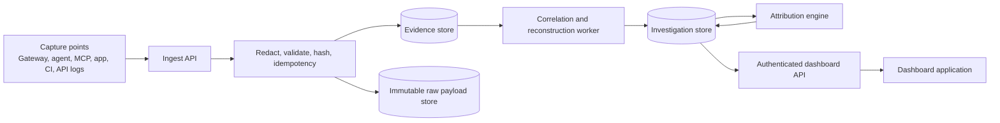

# From Demo Dashboard to Live Forensics Workbench

## Purpose

The current dashboard presents the intended AI Forensics and Attribution workflow, but its investigations, metrics, evidence, timelines, AI systems, and findings are static demo data in `index.html`.

This plan defines the technical work required to make every dashboard view read real forensic data without weakening the evidence-first model:

1. Capture real AI and surrounding-system events.
2. Preserve, redact, and verify the source evidence.
3. Reconstruct an investigation from that evidence.
4. Derive explicit root-cause and AI-attribution conclusions.
5. Serve authenticated, traceable data to the dashboard.

## Forensic Scope

The engine is a black box retained before an incident, then opened when an AI-related failure is suspected. Its job is to reconstruct the sequence of events and determine the root cause and the role AI actually played: `AI_CAUSED`, `AI_CONTRIBUTED`, `AI_INVOLVED_NOT_CAUSAL`, `NON_AI_ROOT_CAUSE`, or `INSUFFICIENT_EVIDENCE`.

It does **not** calculate financial loss, estimate business damage, or make a liability determination. An outside incident-management or business-impact process may use the forensic record, but those conclusions are not generated by this engine and must not appear as attribution evidence.

The timeline is a retained forensic artifact, not an incident-only visual. Authorized investigators must be able to reopen an investigation later, navigate from every timeline event to the source evidence, and see explicit gaps where capture coverage was unavailable.

This public repository is dashboard-only. It contains no private engine source code, credentials, evidence, or live case data. The private implementation repository is the source of truth for production work.

## Current State

Already implemented in the private engine:

- Local FlightRecord ingestion, query, and deterministic evidence-first attribution.
- Local JSONL evidence storage, redaction, bounded storage, and hash chaining.
- Gateway capture for supported model-provider traffic and a local CLI reader.

Not yet implemented:

- Persistent investigations/cases.
- Durable structured evidence, timeline, finding, or contributing-factor records.
- Correlation between AI events, tool/API calls, application events, and a detected failure.
- AI-system inventory derived from observed evidence.
- Dashboard data API, dashboard authentication, or a production deployment.
- A live dashboard client; the current file embeds `const DATA = ...` demo records.

## Product Rules That the Live System Must Preserve

- Evidence first. Derived conclusions must always link to immutable evidence IDs.
- **Evidence** is an immutable captured source record: the event, source, timestamps, redaction state, hashes, chain state, and retained payload reference. It is never rewritten to fit a narrative.
- **Forensic Notes** are optional, reviewable navigation aids that describe what the evidence set shows and link to exact evidence IDs. They do not alter evidence, label behavior as right or wrong, or establish impact, liability, or truth beyond the captured record.
- Root Cause and AI Attribution are independent fields. Do not infer one from the other.
- Business impact and financial loss are outside the attribution model and must not affect its verdict.
- Unknown remains Unknown. The API must return missing evidence and capture gaps rather than manufacture a conclusion.
- Evidence strength is qualitative: `Strong`, `Moderate`, or `Limited`. Do not display invented percentages.
- Every conclusion records the evidence set, policy/rule version, actor, and time used to create it.
- A broken evidence chain, unavailable source, or incomplete causal window makes attribution provisional.

## Target Architecture



### Runtime components

| Component | Responsibility | Initial implementation choice |
| --- | --- | --- |
| Capture points | Emit AI, tool, app, and failure-detection events with correlation IDs. | Extend the existing gateway and universal ingest contract; add SDK/agent/CI adapters. |
| Ingest API | Authenticate capture clients, validate schemas, redact secrets, hash payloads, deduplicate retries. | Node.js API service based on current route patterns. |
| Evidence store | Store normalized, queryable metadata and evidence relations. | PostgreSQL. |
| Raw evidence store | Retain encrypted redacted source payloads too large for PostgreSQL. | S3-compatible object storage with immutable object versioning. |
| Worker | Correlate records, build timelines, detect gaps, and update case summaries. | Queue-backed Node.js worker. |
| Attribution service | Run deterministic policy against a bounded investigation evidence set. | Version every run. |
| Dashboard API | Read-only, authenticated API tailored to the dashboard views. | `/api/v1/*` routes with RBAC and tenant scoping. |
| Dashboard | Replace embedded demo data with API requests, loading/empty/error states, and evidence navigation. | Build and deploy a protected production application. |

## Required Data Model

Use a relational database for the investigation graph. Raw content remains separately retained and is referenced by immutable hashes and storage keys.

| Entity | Required fields | Notes |
| --- | --- | --- |
| Workspace | `id`, `name`, `created_at` | Tenant boundary for every record. |
| AI System | `id`, `workspace_id`, `name`, `application`, `provider`, `model`, `first_seen_at`, `last_seen_at` | Build from observed evidence, not manual claims alone. |
| Investigation | `id`, `workspace_id`, `title`, `status`, `detected_at`, `last_known_good_at`, `failure_summary`, `root_cause`, `root_cause_status`, `evidence_strength`, `created_at`, `updated_at` | The primary dashboard row. Root cause may be `unknown` while investigating. |
| Evidence Item | `id`, `workspace_id`, `investigation_id`, `type`, `source`, `occurred_at`, `captured_at`, `payload_hash`, `chain_hash`, `raw_object_key`, `redaction_status`, `integrity_status` | E-IDs in the dashboard come from this entity. |
| Timeline Event | `id`, `investigation_id`, `evidence_id`, `occurred_at`, `kind`, `summary`, `role` | Retained forensic timeline; `role` supports `observed`, `ai_influence`, `failure_origin`, or `gap`. |
| Evidence Relation | `from_evidence_id`, `to_evidence_id`, `relation_type`, `reason` | Connects causal sequence, shared correlation IDs, and supporting material. |
| Forensic Note | `id`, `investigation_id`, `ordinal`, `statement`, `status`, `created_at`, `created_by` | Reviewable neutral observation; must link to evidence and cannot mutate it. |
| Note Evidence | `note_id`, `evidence_id`, `reference_type` | Makes note-to-evidence navigation real. |
| Contributing Factor | `id`, `investigation_id`, `statement`, `status`, `evidence_basis` | Must never be merged into root cause. |
| Attribution Run | `id`, `investigation_id`, `verdict`, `headline`, `policy_version`, `chain_intact`, `created_at`, `created_by` | Store the actual analysis output, including gaps. |
| Attribution Evidence | `attribution_run_id`, `evidence_id`, `role`, `reason` | Records exactly why a verdict was returned. |
| Case Report | `id`, `investigation_id`, `format`, `evidence_manifest_hash`, `generated_at`, `generated_by`, `audit_event_id` | Immutable export manifest; generated from persisted case state. |
| Audit Event | `id`, `workspace_id`, `actor_id`, `action`, `entity_type`, `entity_id`, `at` | Covers reads of sensitive evidence and all conclusion edits. |

## Evidence and Correlation Contract

Every event sent to ingestion must have a stable envelope. Extend the existing FlightRecord input rather than replacing it abruptly.

```json
{
  "eventId": "uuid",
  "workspaceId": "uuid",
  "occurredAt": "2026-08-18T09:41:07.000Z",
  "capturePoint": "gateway|agent|mcp|application|tool|ci|detector",
  "eventType": "ai_response|tool_call|tool_result|application_event|api_call|failure_detected",
  "correlationId": "request-or-trace-id",
  "causationId": "parent-event-id-or-null",
  "aiSystem": { "name": "...", "provider": "...", "model": "..." },
  "target": { "kind": "file|table|endpoint|resource", "value": "..." },
  "payload": { "redacted": true, "...": "schema-specific fields" }
}
```

Rules:

- The server stamps `capturedAt`, canonical payload hash, chain/hash metadata, and the authenticated workspace.
- `eventId` makes ingestion idempotent. Retried requests must return the original record, not create duplicates.
- Capture adapters must propagate W3C trace context or a product correlation ID through model calls, tools, application handlers, and failure detectors.
- Raw prompts/responses remain opt-in, encrypted, redacted, and access-controlled. Metadata and short excerpts are the default.
- A timeline event must link to at least one Evidence Item. A visual gap must exist where the system cannot bridge two events.

## Investigation Lifecycle

1. A failure detector, an operator, or an integration creates an Investigation with detection time and affected surface.
2. A worker scopes evidence by workspace, time window, correlation ID, branch/commit, target, and related system IDs.
3. The worker creates Timeline Events from source evidence and explicitly marks missing coverage.
4. An analyst may attach evidence, correct time boundaries, and record facts. These edits are audited.
5. The attribution service runs against the investigation's fixed evidence set and stores an Attribution Run.
6. Root cause, contributing factors, and forensic notes are recorded separately. Every note must contain direct evidence links.
7. The timeline and its source evidence remain queryable after closure, subject to retention and access policy.
8. The dashboard reads only persisted investigation projections; it must never recreate conclusions in the browser.

## API Required by the Dashboard

All routes are workspace-scoped, authenticated, authorization-checked, paginated, and return only redacted content appropriate for the caller's role.

| Route | Purpose | Dashboard consumer |
| --- | --- | --- |
| `GET /api/v1/dashboard/summary` | Counts for active investigations, failures analyzed, root cause identified, awaiting evidence. | Overview metrics. |
| `GET /api/v1/investigations` | Paginated/filterable investigation list with title, time, AI system, root cause, attribution, strength, status. | Overview and Investigations table. |
| `POST /api/v1/investigations` | Create an investigation from a detector or analyst input. | Case creation workflow. |
| `GET /api/v1/investigations/{id}` | Case header, What Happened, Failure, Root Cause, Attribution, gaps. | Investigation detail. |
| `GET /api/v1/investigations/{id}/timeline` | Ordered event projection with evidence links and `observed`/`ai_influence`/`failure_origin`/`gap` roles. | Reconstruction timeline. |
| `GET /api/v1/investigations/{id}/evidence` | Evidence items with source, model/provider, timestamps, integrity, and strength basis. | Detail evidence list. |
| `GET /api/v1/investigations/{id}/notes` | Reviewable forensic notes with evidence references. | Detail and cross-case notes view. |
| `POST /api/v1/investigations/{id}/attribution-runs` | Run deterministic attribution on a selected evidence/time window. | Analyst action, not an automatic browser calculation. |
| `POST /api/v1/investigations/{id}/reports` | Generate an audited HTML/PDF/JSON case-record export from a fixed evidence manifest. | Export case record control. |
| `GET /api/v1/reports/{id}` | Download a previously generated, audited export. | Report retrieval. |
| `GET /api/v1/evidence` | Cross-investigation evidence search. | Evidence view. |
| `GET /api/v1/ai-systems` | Observed AI-system inventory and related investigations. | AI Systems view. |
| `GET /api/v1/notes` | Cross-investigation forensic notes with supporting evidence. | Forensic Notes view. |

### Case-record export requirements

An export is a forensic package, not a decision or impact report. It must include the investigation scope, time bounds, timeline, evidence inventory and IDs, redaction state, hash/chain verification result, capture gaps, AI-role/root-cause references with their supporting evidence, forensic notes, policy version, retention status, generation time, and audit reference. It must state that it does not determine whether an action was right or wrong, assess financial/business impact, or establish liability.

The server creates a fixed evidence manifest before rendering HTML, PDF, or JSON. The manifest hash, exporter identity, and access event are persisted in `Case Report`; a later download returns the same package or a new, separately audited version. Browser-side export is suitable only for the current demo and must not become the live source of record.

## Dashboard Changes Required

The public Pages dashboard cannot safely show real client data because it has no user authentication, no protected API origin, and no tenant boundary. It should remain a presentation/demo site.

For the live product dashboard:

1. Move the workbench markup and styles into the private application.
2. Remove `const DATA` and replace each view with typed API requests.
3. Add loading, empty, unavailable, and insufficient-evidence states.
4. Preserve evidence deep links, but resolve them through authorized API reads.
5. Add investigation creation and evidence-window refinement for authorized analysts.
6. Render the current verdict plus its policy version, chain state, evidence IDs, and known gaps.
7. Do not render raw content by default; retrieve it only through explicit, audited access.

The public repository may be updated only with design/demo improvements. It must not point to a privileged API using an embedded token or accept browser-side credentials that could expose live evidence.

## Security and Operations Requirements

- Authentication: SSO/OIDC for users; separately scoped credentials or mTLS for capture agents.
- Authorization: workspace isolation and role-based permissions for analyst, reviewer, administrator, and capture service accounts.
- Data protection: TLS in transit, envelope encryption at rest, KMS-managed keys, secret redaction before persistence, no secrets in client logs.
- Integrity: append-only evidence records, hash chain/merkle verification, immutable raw-object retention, audit events, and versioned attribution rules.
- Reliability: transactional outbox or queue, idempotent ingestion, retry policy, dead-letter queue, database backups, restore test, monitoring, and alerting.
- Privacy/retention: configurable retention by workspace, deletion workflow for permitted data, minimal default capture depth, and export controls.
- Abuse protection: request size limits, schema validation, rate limiting, allowlisted upstreams, SSRF protections, and content redaction tests.
- Deployment: keep the API and worker in a private production environment; use managed PostgreSQL, object storage, a secrets manager, and observability with redacted logs.

## Delivery Plan and Acceptance Criteria

### Phase 1: Case and Evidence Foundation

Build the database schema, migrations, authentication, workspace model, durable ingestion, and investigation CRUD. Import the current local FlightRecord schema through an adapter.

Done when:

- A captured record is persisted with an immutable evidence ID and hash.
- A user can create an investigation and attach/scoped evidence.
- Duplicate ingest is idempotent and a different workspace cannot read the record.

### Phase 2: Correlation and Reconstruction

Add capture adapters for agent/tool/application/failure events, correlation propagation, background reconstruction, timeline projections, AI-system inventory, and evidence search.

Done when:

- A real end-to-end incident creates an ordered timeline entirely backed by evidence IDs.
- Missing capture coverage appears as a gap, not a fabricated step.
- The dashboard Evidence and AI Systems views read live data.

### Phase 3: Findings and Attribution

Persist findings, root cause, contributing factors, attribution runs, evidence links, policy versions, review workflow, and chain-integrity gates.

Done when:

- Root cause and AI attribution can be different and are displayed separately.
- Every finding has at least one linked evidence item.
- A broken chain or weak window visibly limits the verdict.

### Phase 4: Production Dashboard and Operations

Replace the demo data in the private application, add protected deployment, audit logs, observability, backup/restore tests, load tests, and security review.

Done when:

- The dashboard metrics and all five data views are API-driven.
- An authorized partner can access only their workspace through the production app.
- The public Pages site remains demo-only and cannot expose live case data.

## First Build Sequence

1. Select production hosting, PostgreSQL, object storage, identity provider, and secret manager.
2. Define the event-envelope JSON Schema and versioning policy.
3. Create database migrations for Workspace, Investigation, Evidence Item, Timeline Event, Finding, Attribution Run, and their link tables.
4. Add authenticated ingestion with idempotency and redacted payload storage.
5. Build `GET /api/v1/investigations` and `GET /api/v1/investigations/{id}` from persisted projections.
6. Convert the private dashboard from embedded demo data to typed API calls.
7. Add correlation worker, then source-specific capture adapters.
8. Add persistent forensic-note, attribution, and case-record export workflows with audit trails.
9. Conduct security, recovery, and end-to-end evidence traceability validation before onboarding real users.

## Explicit Non-Goals for the First Live Release

- No public unauthenticated access to real investigations.
- No browser-side inference of root cause or attribution.
- No business-impact, loss, or liability calculation by the forensic engine.
- No claim that AI caused a failure without evidence links and a bounded causal window.
- No full-prompt retention by default.
- No deployment of private engine source to this public dashboard repository.
